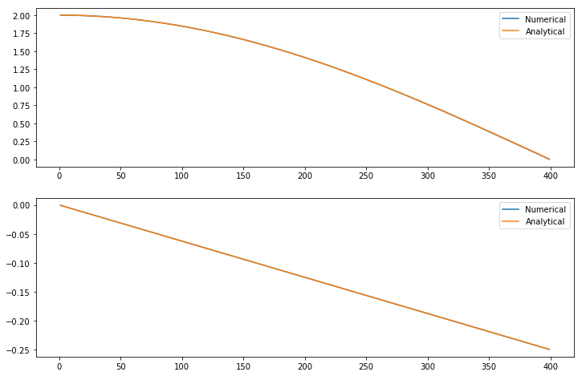

% The Mathematics of Synthesis
% Jamie Quinn

# What is Synthesis?

##
> The artificial (electronic) production of sound

# What is Sound?

## To the Physicist
> Sound is a vibration that typically propagates as an audible wave of pressure

## To the Psychologist
> Sound is the reception of such waves and their perception by the brain

##
> Sound is a vibration that typically propagates as an audible wave of pressure

> Sound is the reception of such waves and their perception by the brain

# The Three Components of Synthesised Sound

## Pitch

<https://commons.wikimedia.org/wiki/File:Sine_waves_different_frequencies.svg>

## Timbre

## Analysing Timbre

$$g(t) = a_0/2 + \sum^{\infty}_{n=1} a_n \cos(2n\pi f t) + \sum^{\infty}_{n=1} b_n \sin(2n\pi f t)$$

. . .

$$g(t) = \sin(2 \cdot 5\pi t) + \frac{1}{2} \sin(2 \cdot 14\pi t)$$

. . .

## Volume

# Types of Synthesis

## 

- Physically Based
- Additive
- Subtractive
- Frequency modulated
- Sample based

# Physically Based

##

Using mathematical models to emulate a sound, such as a bowed instrument

<video class="stretch" data-autoplay loop src="./5_glissando.mp4"></video>

<http://www.ness.music.ed.ac.uk/>

. . .

<audio data-autoplay src="./5_glissando.mp3"></audio>

## 

Or a gong using a linear model

. . .

<audio data-autoplay src="./shellcurved_linear.mp4"></audio>

## 

and a nonlinear model

. . .

<audio data-autoplay src="./shellcurved_nonlinear.mp4"></audio>

# Sample Based

## {data-background-iframe="https://www.youtube-nocookie.com/embed/U21TOJ-fpCU?rel=0"}

# Additive

##

<http://www.ams.org/publicoutreach/feature-column/fcarc-synthesizer>

. . .

<audio data-autoplay src="./GString.mp3"></audio>

. . .

. . .

<audio data-autoplay src="./gstring.fourier.mp3"></audio>

# Frequency Modulated

##

<audio data-autoplay src="./fmspectrum.0.mp3"></audio>

##

<audio data-autoplay src="./fmspectrum.1.mp3"></audio>

##

<audio data-autoplay src="./fmspectrum.2.mp3"></audio>

##

<audio data-autoplay src="./fmspectrum.3.mp3"></audio>

##

<audio data-autoplay src="./fmspectrum.4.mp3"></audio>

##

<audio data-autoplay src="./fmspectrum.5.mp3"></audio>

## Negative Frequencies?

. . .

. . .

\ 

## Famous Examples - Yamaha DX7

##

{.style width=300}
<audio data-autoplay src="./Take_On_Me.mp3"></audio>

##

{.style width=300}
<audio data-autoplay src="./Hungry_Eyes.mp3"></audio>

##

{.style width=300}
<audio data-autoplay src="./You_Spin_Me_Round.mp3"></audio>

# Subtractive Synthesis

## 

- Oscillate harmonically rich wave - Pitch
- Filter - Timbre
- ASDR envelopes - Volume

## The Oscillator

. . .

<audio data-autoplay src="./sine.mp3"></audio>

## The Oscillator

. . .

<audio data-autoplay src="./saw.mp3"></audio>

## The Oscillator

. . .

<audio data-autoplay src="./square.mp3"></audio>

## The Filter

> Allowing certain frequencies to be heard while damping others to produce timbre

## The Low Pass Filter

## The Simplest Low Pass Filter

$$y_n = x_n + x_{n-1}$$

. . .

## Frequency Response

## Frequency Response

## ASDR

# Conclusion
